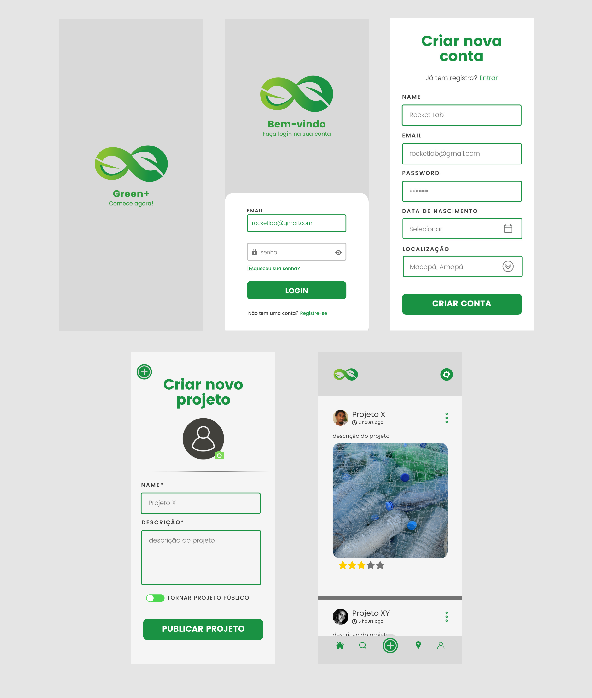

# Projeto GreenPlus

## É um repositório com toda a documentação do projeto GreenPlus, desde a entrevista com o cliente até o planejamento de implementação do aplicativo, e implementação real.

 

GreenPlus é um projeto que visa criar um meio de comunicação entre pontos de coleta de materiais recicláveis e pessoas que queiram se desfazer desses materiais. O projeto também conta com compartilhamentos de projetos pessoais feitos com esses materias através de imagens e tutorial, que podem ser avaliado por outros usuários.

 

 

A parte teórica do projeto foi criado na matéria de __engenharia de software__ como simulação de projeto feito para uma empresa fictícia, conforme o que foi requisitado na matéria e pelo grupo/empresa.

## Etapas de planejamento do projeto:
- [Gerenciamento de configuração](projeto/plano_gerenciamento_configuracao.pdf)
- [Diagramas de classes, atividades, sequencias e pacotes](projeto/diagramas/)
- [Documento de requisitos](projeto/documento_requisitos.pdf)
- [Interface](projeto/interface/)
- [Termo de aceite](projeto/Termo%20de%20Aceite%20-%20RocketLab.pdf)

## Implementação
### O backend foi desenvolvido por [carlos-heins](https://github.com/carlos-heins).

## Licença

Licenciado sob a [MIT License](./LICENSE).
